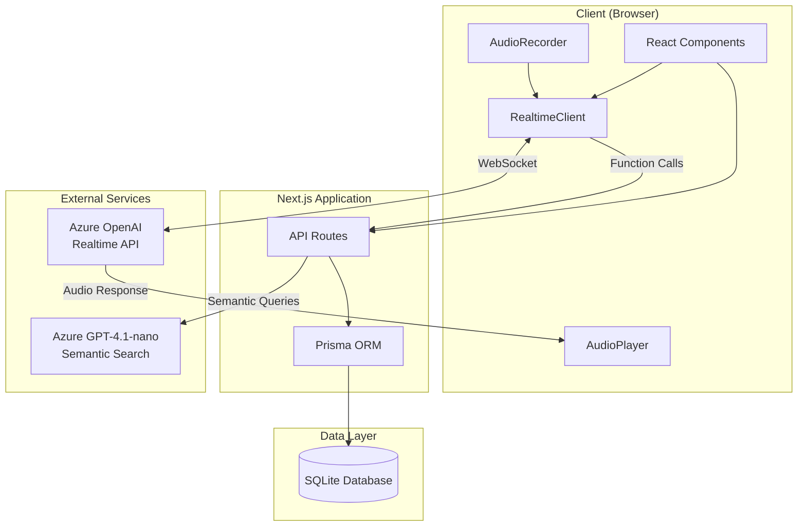
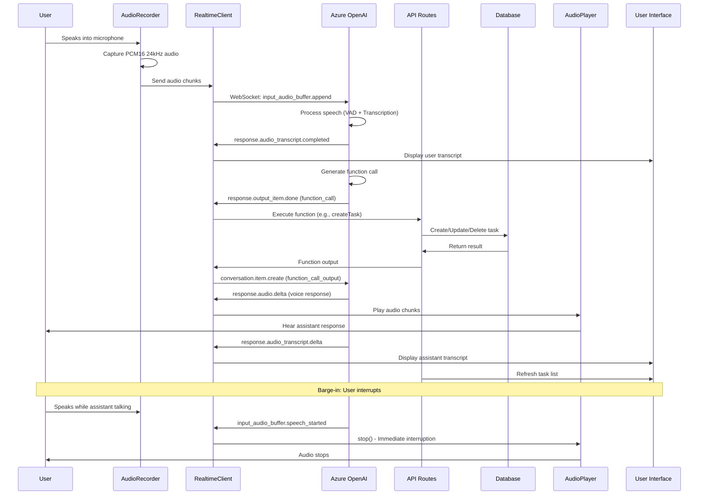
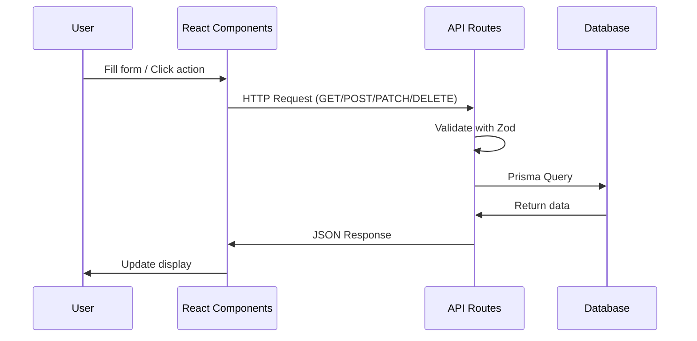
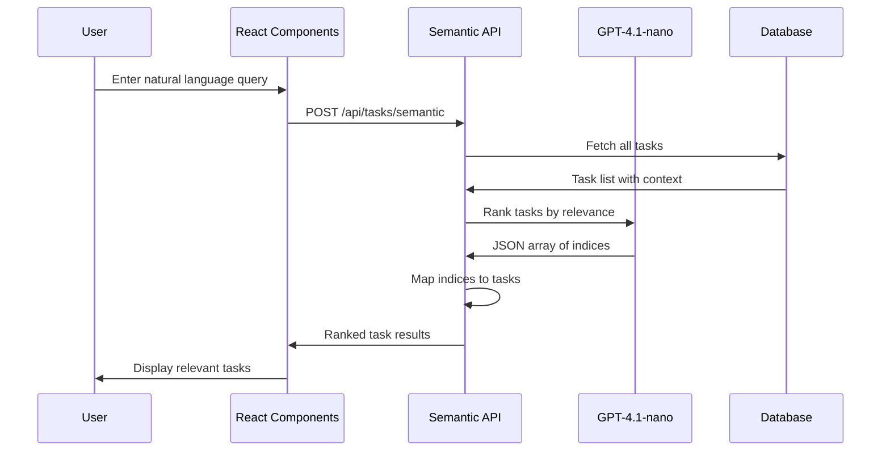

# Voice Tasks - AI-Powered Task Management

A modern, voice-enabled task management application built with Next.js and Azure OpenAI Realtime API. Manage your tasks through natural voice commands or traditional UI, with intelligent semantic search and real-time transcription.

## 🎯 Project Overview

Voice Tasks is a full-stack task management application that combines traditional UI interactions with cutting-edge voice AI capabilities. Built using **Google Antigravity** (AI code generation tool), the application enables hands-free task management through Azure OpenAI's Realtime API, featuring real-time transcription, semantic search, and intelligent task organization.

### Key Features

- 🎤 **Voice Commands** - Manage tasks hands-free using Azure OpenAI Realtime API
- 🔍 **Semantic Search** - Find tasks using natural language queries powered by GPT-4.1-nano
- 📝 **Real-time Transcription** - See both user and assistant transcripts in real-time
- ⚡ **Voice Interruption (Barge-in)** - Interrupt the assistant mid-sentence for natural conversations
- ↩️ **Undo/Redo** - Undo voice actions with simple commands
- 📊 **Task Digest** - Get smart summaries of your workload and priorities
- 🗑️ **Bulk Operations** - Delete all tasks with a single voice command
- ⌨️ **Traditional UI** - Full-featured web interface with keyboard shortcuts
- 🏷️ **Tag-based Categorization** - Organize tasks with tags for better search

## 🛠️ Tech Stack

- **Framework**: Next.js 14 (App Router)
- **Language**: TypeScript
- **UI Library**: React 18
- **Styling**: Tailwind CSS
- **UI Components**: Radix UI (via Shadcn UI)
- **Database**: SQLite with Prisma ORM
- **AI Services**: 
  - Azure OpenAI Realtime API (voice interactions)
  - Azure OpenAI GPT-4.1-nano (semantic search)
- **Audio**: Web Audio API (AudioWorklet/MediaRecorder)
- **Validation**: Zod
- **Forms**: React Hook Form

## 📐 Architecture

### System Architecture



### Data Flow: Voice Interaction



### Data Flow: Traditional UI



### Data Flow: Semantic Search



## 🚀 Getting Started

### Prerequisites

- Node.js 18+ and npm
- Azure OpenAI account with:
  - Realtime API access
  - GPT-4.1-nano deployment (for semantic search)
- Modern browser with Web Audio API support

### Installation

1. **Clone the repository**
   ```bash
   git clone https://github.com/AndyMental/VoiceTasks.git
   cd VoiceTasks
   ```

2. **Install dependencies**
   ```bash
   npm install
   ```

3. **Set up environment variables**
   ```bash
   cp .env.example .env
   ```
   
   Edit `.env` and add your Azure OpenAI credentials:
   ```env
   AZURE_OPENAI_ENDPOINT=https://your-endpoint.openai.azure.com
   AZURE_OPENAI_API_KEY=your-api-key
   AZURE_OPENAI_DEPLOYMENT=gpt-realtime-mini
   AZURE_GPT4_1_NANO_ENDPOINT=https://your-endpoint.openai.azure.com/openai/deployments/gpt-4.1-nano
   AZURE_GPT4_1_NANO_API_KEY=your-api-key
   AZURE_GPT4_1_NANO_API_VERSION=2025-01-01-preview
   DATABASE_URL=file:./data/tasks.db
   ```

4. **Set up the database**
   ```bash
   npx prisma migrate dev
   npx prisma generate
   ```

5. **Seed the database (optional)**
   ```bash
   npm run seed
   ```

6. **Start the development server**
   ```bash
   npm run dev
   ```

7. **Open your browser**
   Navigate to [http://localhost:3000](http://localhost:3000)

## 📋 Environment Variables

| Variable | Description | Required |
|----------|-------------|----------|
| `AZURE_OPENAI_ENDPOINT` | Azure OpenAI endpoint URL (e.g., `https://your-resource.openai.azure.com`) | Yes |
| `AZURE_OPENAI_API_KEY` | Azure OpenAI API key for Realtime API | Yes |
| `AZURE_OPENAI_DEPLOYMENT` | Deployment name for Realtime API (e.g., `gpt-realtime-mini`) | Yes |
| `AZURE_GPT4_1_NANO_ENDPOINT` | Full endpoint URL for GPT-4.1-nano semantic search | Yes |
| `AZURE_GPT4_1_NANO_API_KEY` | API key for GPT-4.1-nano (can be same as above) | Yes |
| `AZURE_GPT4_1_NANO_API_VERSION` | API version for semantic search (default: `2025-01-01-preview`) | No |
| `DATABASE_URL` | SQLite database path (e.g., `file:./data/tasks.db`) | Yes |

See `.env.example` for a complete template.

## 🎙️ Voice Features

### Voice Interaction

The application supports natural voice interactions through Azure OpenAI Realtime API:

- **Real-time Transcription**: See what you and the assistant say in real-time
- **Function Calling**: The assistant can create, delete, list, and search tasks
- **Context Awareness**: The assistant knows your current tasks when you connect
- **Voice Interruption**: Interrupt the assistant mid-sentence for natural flow
- **Audio Playback**: Hear the assistant's voice responses

### Function Calling Tools

The voice assistant has access to the following tools:

#### `createTask`
Create a new task with voice commands.

**Parameters:**
- `title` (string, required) - Task title
- `priority` (string, optional) - "LOW", "MEDIUM", or "HIGH"
- `description` (string, optional) - Task description
- `tags` (string[], optional) - Array of tag names for categorization

**Example**: "Create a high priority task to buy groceries with tags work and urgent"

#### `deleteTask`
Delete a specific task by ID.

**Parameters:**
- `id` (string, required) - Task UUID

**Example**: "Delete task with ID abc-123"

#### `listTasks`
List all tasks with their IDs. The assistant uses this to find task IDs before deletion.

**Parameters:** None

**Example**: "What tasks do I have?"

#### `deleteAllTasks`
Delete all tasks at once.

**Parameters:** None

**Example**: "Delete all my tasks" or "Clear everything"

#### `semanticSearch`
Find tasks using natural language queries.

**Parameters:**
- `query` (string, required) - Natural language search query

**Example**: "Find that task about the leaky sink" or "Where is the thing about groceries?"

#### `getTaskDigest`
Get a smart summary of your workload and priorities.

**Parameters:** None

**Example**: "How's my day looking?" or "Give me a summary"

#### `undo`
Undo the last action (create or delete).

**Parameters:** None

**Example**: "Undo that" or "Revert" or "Wait, stop"

## 📡 API Documentation

### Tasks API

#### `GET /api/tasks`
List all tasks with optional filtering, sorting, and search.

**Query Parameters:**
- `status` (optional) - Filter by status: "PENDING", "DONE", or "ALL"
- `search` (optional) - Search in title and description
- `sortBy` (optional) - Sort field: "createdAt", "dueDate", or "priority" (default: "createdAt")
- `order` (optional) - Sort order: "asc" or "desc" (default: "desc")

**Response:**
```json
{
  "success": true,
  "data": [
    {
      "id": "uuid",
      "title": "Task title",
      "description": "Task description",
      "status": "PENDING",
      "priority": "MEDIUM",
      "dueDate": "2025-01-01T00:00:00Z",
      "tags": [{"id": "uuid", "name": "work"}],
      "createdAt": "2025-01-01T00:00:00Z",
      "updatedAt": "2025-01-01T00:00:00Z"
    }
  ]
}
```

#### `POST /api/tasks`
Create a new task.

**Request Body:**
```json
{
  "title": "Task title",
  "description": "Optional description",
  "status": "PENDING",
  "priority": "MEDIUM",
  "dueDate": "2025-01-01T00:00:00Z",
  "tags": ["work", "urgent"]
}
```

**Response:**
```json
{
  "success": true,
  "data": { /* task object */ }
}
```

#### `PATCH /api/tasks/[id]`
Update a task.

**Request Body:**
```json
{
  "title": "Updated title",
  "status": "DONE",
  "priority": "HIGH"
}
```

#### `DELETE /api/tasks/[id]`
Delete a specific task.

**Response:**
```json
{
  "success": true,
  "message": "Task deleted"
}
```

#### `DELETE /api/tasks`
Delete all tasks (bulk operation).

**Response:**
```json
{
  "success": true,
  "message": "All tasks deleted"
}
```

### Semantic Search API

#### `POST /api/tasks/semantic`
Search tasks using natural language.

**Request Body:**
```json
{
  "query": "Find tasks about groceries"
}
```

**Response:**
```json
{
  "success": true,
  "data": [ /* ranked task array */ ]
}
```

### Voice API

#### `GET /api/voice/token`
Get Azure OpenAI credentials for Realtime API connection.

**Response:**
```json
{
  "endpoint": "https://your-endpoint.openai.azure.com",
  "apiKey": "your-api-key",
  "deployment": "gpt-realtime-mini"
}
```

## 🏗️ Development Phases

This project was developed in phases using **Google Antigravity** (AI code generation tool). The development history is documented in `antigravity_chat_history.md`.

### Phase 1: Foundation & Traditional UI
- ✅ Next.js project setup with Shadcn UI & Tailwind CSS
- ✅ Prisma ORM with SQLite database
- ✅ REST API endpoints (GET, POST, PATCH, DELETE)
- ✅ Task list view with sorting, filtering, search
- ✅ Task creation/editing dialogs
- ✅ Keyboard shortcuts (e.g., 'n' for new task)
- ✅ Verified with browser-based automated testing

### Phase 2: Voice Integration
- ✅ Azure OpenAI Realtime API WebSocket connection
- ✅ AudioRecorder for PCM16 24kHz audio capture
- ✅ RealtimeClient for WebSocket management and event handling
- ✅ Function calling tools: createTask, deleteTask, listTasks
- ✅ Live transcript display (user and assistant)
- ✅ 3-column layout (Tasks, Transcript, Logs)

### Phase 3: Task Deletion Bug Fix & Bulk Delete
- ✅ Added DELETE /api/tasks for bulk deletion
- ✅ Improved ID visibility in listTasks tool
- ✅ deleteAllTasks tool implementation

### Phase 4: Advanced Function Calling
- ✅ Context injection (pre-load assistant with current task state)
- ✅ Semantic search tool using GPT-4.1-nano
- ✅ Smart summarizer (getTaskDigest tool)
- ✅ Undo functionality with action history tracking
- ✅ State sync improvements using React Refs

### Phase 5: Voice Interruption (Barge-in)
- ✅ input_audio_buffer.speech_started event handling
- ✅ AudioPlayer.stop() for immediate playback interruption
- ✅ VAD (Voice Activity Detection) tuning (300ms silence duration)

### Phase 6: Deep Tag Integration
- ✅ Tags parameter in createTask tool
- 🔄 Tag-based semantic search enhancement (partial)

## 🤖 Google Antigravity Attribution

This repository was created using **Google Antigravity**, an AI-powered code generation tool. The development followed a structured, phased approach with detailed implementation plans, task tracking, and comprehensive walkthroughs.

### Development Details

- **Tool**: Google Antigravity (AI code generation tool)
- **Conversation ID**: `45e9b356-9759-4e73-af4c-870bad78215b`
- **Development Approach**: Phased implementation with:
  - Implementation plans for each phase
  - Structured task lists with checkboxes
  - Detailed walkthroughs of completed features
  - Browser-based verification and testing

### Reference Documentation

For complete development history, see `antigravity_chat_history.md` which contains:
- Implementation plans for all phases
- Task lists showing completed work
- Walkthroughs of features
- Metadata and timestamps
- Verification results

### Phases Completed

1. **Phase 1**: Traditional UI (fully verified with browser testing)
2. **Phase 2**: Voice Integration (WebSocket, audio capture, function calling)
3. **Phase 3**: Bug fixes and bulk operations
4. **Phase 4**: Advanced intelligence (semantic search, undo, digest)
5. **Phase 5**: Voice interruption (barge-in)
6. **Phase 6**: Tag integration (partial)

## 🚢 Deployment

### Vercel Deployment

This application is configured for deployment on Vercel.

#### Prerequisites

1. Vercel account connected to your GitHub repository
2. All environment variables configured in Vercel dashboard

#### Deployment Steps

1. **Connect Repository to Vercel**
   - Go to [Vercel Dashboard](https://vercel.com/dashboard)
   - Click "New Project"
   - Import your GitHub repository: `AndyMental/VoiceTasks`

2. **Configure Environment Variables**
   In Vercel project settings, add all required environment variables:
   - `AZURE_OPENAI_ENDPOINT`
   - `AZURE_OPENAI_API_KEY`
   - `AZURE_OPENAI_DEPLOYMENT`
   - `AZURE_GPT4_1_NANO_ENDPOINT`
   - `AZURE_GPT4_1_NANO_API_KEY`
   - `AZURE_GPT4_1_NANO_API_VERSION`
   - `DATABASE_URL`

3. **Deploy**
   - Vercel will automatically detect Next.js
   - Build command: `npm run build` (auto-detected)
   - Output directory: `.next` (auto-detected)
   - Click "Deploy"

#### Important Notes

⚠️ **SQLite Database Limitation**: Vercel uses an ephemeral filesystem. SQLite databases will **not persist** between deployments or serverless function invocations.

**Options for Production:**
1. **Recommended**: Migrate to a hosted database:
   - Vercel Postgres
   - Supabase
   - PlanetScale
   - Neon
2. **Alternative**: Use serverless storage:
   - Vercel KV
   - Upstash Redis
3. **Development Only**: Document limitation for local development use

#### WebSocket Support

Vercel supports WebSocket connections, so the Azure OpenAI Realtime API will work correctly in production.

## 🧪 Testing & Verification

The application has been verified through:

- **Browser-based automated testing** for UI features
- **Manual voice interaction testing** for voice commands
- **Function call verification** for all tools
- **State synchronization testing** for React state management
- **Audio interruption testing** for barge-in functionality

## 🤝 Contributing

We welcome contributions from solution architects and developers! Here's how to get started:

### Getting Started

1. Fork the repository
2. Create a feature branch: `git checkout -b feature/your-feature-name`
3. Make your changes
4. Test thoroughly (especially voice features if modified)
5. Commit your changes: `git commit -m "Add your feature"`
6. Push to the branch: `git push origin feature/your-feature-name`
7. Open a Pull Request

### Contribution Guidelines

- **Code Style**: Follow existing TypeScript/React patterns
- **Testing**: Test voice features manually before submitting
- **Documentation**: Update README if adding new features
- **Environment Variables**: Never commit `.env` files
- **Database Changes**: Create Prisma migrations for schema changes

### Areas for Contribution

- Enhanced semantic search capabilities
- Additional function calling tools
- Database migration to PostgreSQL/other hosted solutions
- Performance optimizations
- UI/UX improvements
- Test coverage expansion
- Documentation improvements

## 📄 License

This project is private and proprietary.

## 🙏 Acknowledgments

- Built with [Google Antigravity](https://antigravity.google/) AI code generation tool
- Powered by [Azure OpenAI](https://azure.microsoft.com/en-us/products/ai-services/openai-service)
- UI components from [Shadcn UI](https://ui.shadcn.com/)
- Built on [Next.js](https://nextjs.org/)

---

**Repository**: [https://github.com/AndyMental/VoiceTasks](https://github.com/AndyMental/VoiceTasks)

